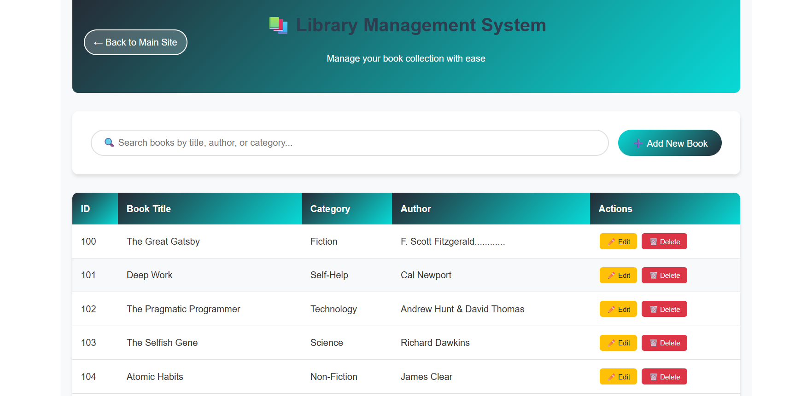
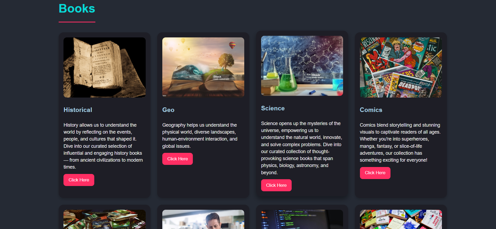

# 📚 Library Management System

A modern, responsive library website and management system.  
Discover knowledge, embrace imagination, and manage your library with ease.

---


## 🚀 Features

- Responsive website for all devices
- Book browsing and management
- Membership registration (online & in-person)
- Team and testimonials sections
- Community events and newsletter
- Integrated enquiry/contact form
- Google Maps location

---

## 🖼️ Screenshots






---

## 🎬 Demo Video

[](https://www.youtube.com/watch?v=YOUR_DEMO_VIDEO_LINK)

---

## 🏁 Getting Started

### 1. Clone the repository

```bash
git clone https://github.com/Jain9384/Library-Management-System.git
cd Library-Management-System
```

### 2. Run locally

#### Option 1: Open `index.html` directly  
Double-click `index.html` or open with Live Server in VS Code.

#### Option 2: Use a local server

```bash
python -m http.server
```
Visit [http://localhost:8000](http://localhost:8000)

---

## 📂 Folder Structure

- `index.html` — Main landing page
- `library-system.html` — Book management UI
- `books.html` — Book details
- `img/` — Images and icons
- `style.css` — Stylesheet
- `script.js` — JavaScript
- `db.json` — Sample book data

---

## 🧑‍💻 Contributing

Pull requests are welcome!  
For major changes, please open an issue first to discuss what you would like to change.

---


