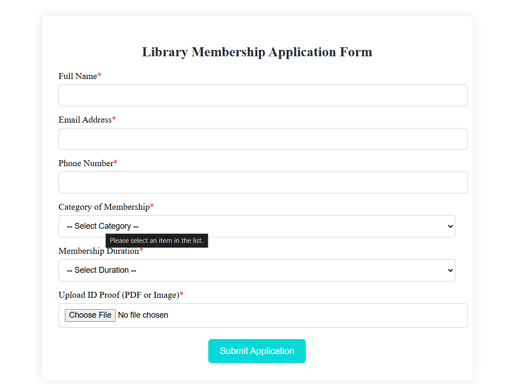
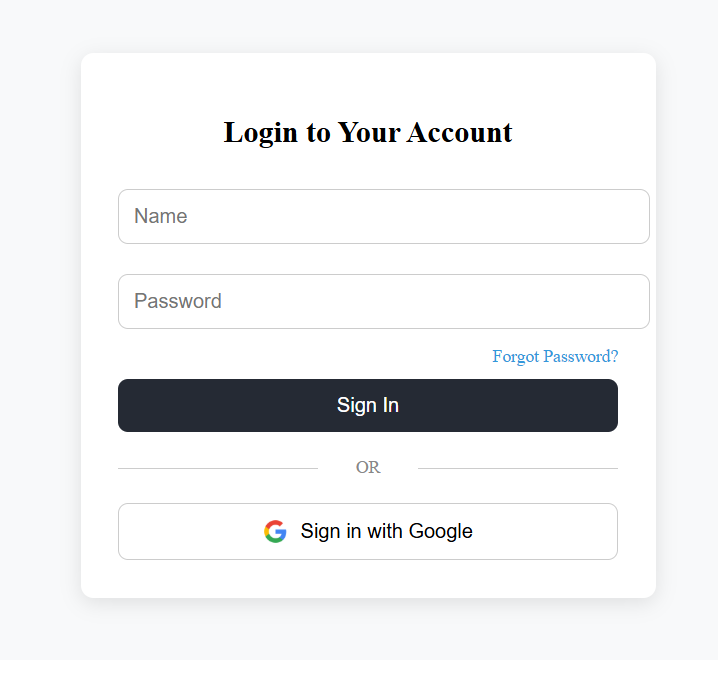
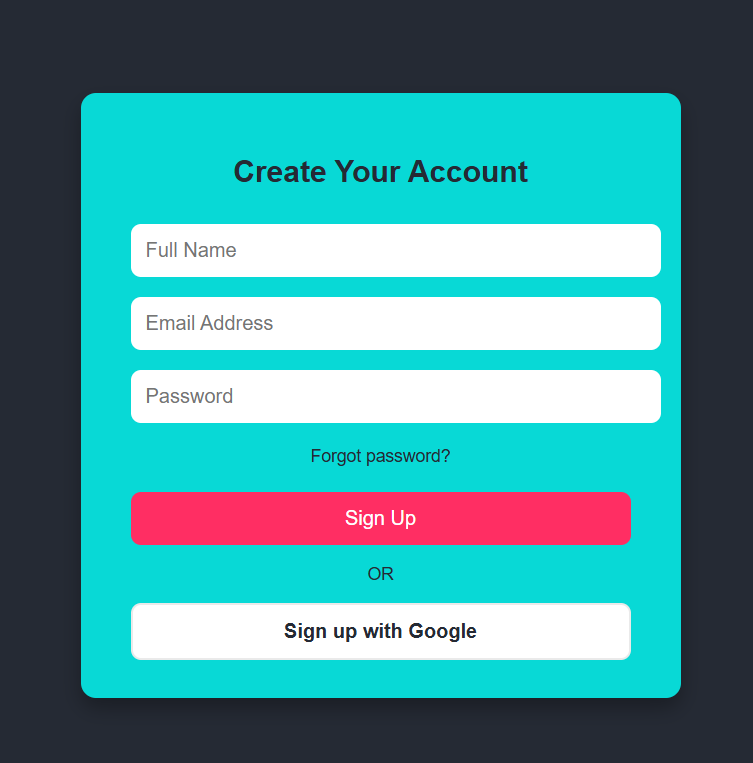

# 📚 Library Management System

A modern, responsive library website and management system.  
Discover knowledge, embrace imagination, and manage your library with ease.

---


## ✨ Features

- **Responsive Design:** Works seamlessly on all devices.
- **Book Browsing & Management:** Explore and manage a vast collection of books.
- **Membership Registration:** Join online or in-person for instant access.
- **Team & Testimonials:** Meet our staff and read visitor feedback.
- **Community Events & Newsletter:** Stay updated and engaged.
- **Enquiry & Contact Form:** Reach out with questions or suggestions.
- **Google Maps Integration:** Find our locations easily.

---

## 🖼️ Screenshots

| Home Page | Product Catalog | Login Page | Books |
|-----------|----------------|------------|-------|
|  |  |  |  |
|  |  |  |  |

---

## 🚀 Getting Started

### 1. Clone the repository

```bash
git clone https://github.com/Jain9384/Library-Management-System.git
cd Library-Management-System
```

### 2. Run Locally

**Option 1:** Open `index.html` directly  
Double-click `index.html` or use Live Server in VS Code.

**Option 2:** Use a local server

```bash
python -m http.server
```
Visit [http://localhost:8000](http://localhost:8000)

---

## 📂 Folder Structure

- `index.html` — Main landing page
- `library-system.html` — Book management UI
- `books.html` — Book details
- `img/` — Images and icons
- `style.css` — Stylesheet
- `script.js` — JavaScript
- `db.json` — Sample book data

---

## 🛠️ Tools Used

- **HTML**
- **CSS**
- **Angular**
- **TypeScript**
- **JavaScript**

---

## 🧑‍💻 Contributing

Pull requests are welcome!  
For major changes, please open an issue first to discuss what you would like to change.

---


